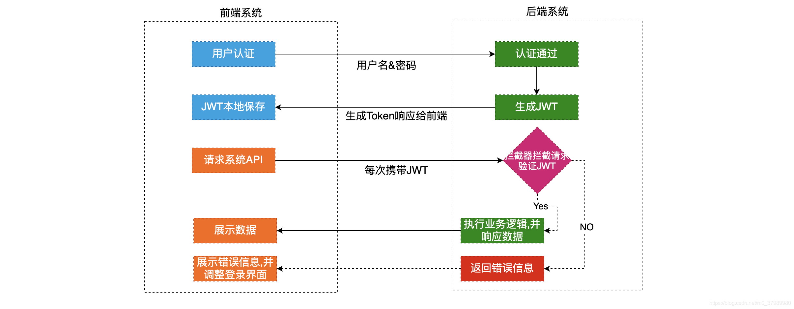

JWT，即 JSON Web Token ，是目前最流行的用户认证方案之一。

基本步骤为：
1. 用户登录时，向服务端发送账号和密码
2. 服务端验证后，生成一个鉴权信息返回给用户，且服务端不再维护状态
3. 后续用户请求，会带上这个鉴权信息，由服务端进行鉴权

> 图片引自[《JWT——概念、认证流程、结构、使用JWT》](https://blog.csdn.net/m0_37989980/article/details/107955069)

说起来很简单，然而我们还需要关注以下问题：
1. 服务端如何验证鉴权信息？为什么选择不可逆加密？
2. 鉴权信息包含哪些数据，为什么需要这些数据？
3. 不可逆加密的密钥泄露了，会产生什么问题？怎么解决？
4. 鉴权信息存在在哪？Cookie 还是 Storage ？怎么考量的？
5. 鉴权过期机制是怎样的？如何重签？如何废弃已签发的 Token？

## 签名验证

服务端怎么确定用户传的鉴权信息是准确的？这就涉及到了签名校验和不可逆加密了。

假设第 2 步服务端验证后，拿到用户信息 `{ id: 123, name: 'gahing'}` ，如果只是单纯用这个用户信息去鉴权，那么其他人只要知道规则就可以随意伪造。

所以需要想个办法，生成一个无法被篡改的签名，并能准确识别到具体用户。无法被篡改意味着用户无法解码签名并重签，那么任何可以对结果逆向的算法都不可用，包括对称加密和非对称加密。

因此，签名选择了不可逆加密，将用户信息通过某种哈希函数转化为一段字符串。后续要想验证这段字符串是否有效，只需要把用户端传过来的用户信息再做一次加密，如果得到的结果和签名一致，说明签名有效未被篡改。
> 不可逆加密的验证本质就是撞库，常用算法有：HMAC、MD5、SHA

小结一下 JWT 的签名验证流程：
1. 服务端将用户信息进行不可逆加密得到签名
2. 将签名和用户信息一起下发给用户
3. 后续请求需要将签名和用户信息一起给到服务端，服务端对用户传过来的用户信息再做一次不可逆加密，并与签名进行对比
4. 若两者一次，说明签名有效，当前用户即为用户信息

## JWT 结构

鉴权信息需要包含哪些信息？为什么需要这些信息？

三大部分

头部.负载.签名

- 算法描述：为什么又要？
- 过期信息

## 不可逆加密与 secret

### secret 泄露

服务端 secret 泄露，意味着可以随意签名，系统不再安全。

泄露可能是内鬼泄露，或者 secret 过于简单。

因此需要通过以下方式降低风险：
- 不使用默认和简易 secret
- 不将 secret 以明文方式存在代码仓库
- 加签系统由单独的系统管控，权限要求较高。

如果发现 secret 泄露了，又该怎么办？
> 只能立即换 secret 了，虽然会导致所有用户需要重新登录，但还是安全性最重要。

## 过期和续签

用于验证的 jwt 被称为 access token ，频繁用于数据请求验证，为避免泄露导致的安全问题，通常过期时间会设置较短。

为避免用户频繁重新登录，jwt 提供了一套续签机制，提供了另一个较长有效期的 token ，又叫 refresh token ；当 access token 过期时会去重新获取。

refresh token 仅会续签请求时传输，因此泄露的风险较小。如果 refresh token 也泄露了，但风险就很大了。只能通过黑名单机制去限制了。

## 存放位置（WIP）

可以放在 Cookie ，也可以放在 storage 。

适用于不同场景

## 总结

1. 鉴权信息包含哪些信息
2. 鉴权信息存在哪个位置
3. 服务端如何验证鉴权信息
4. 服务端的 secret 泄露会有什么问题？怎么避免？

## 拓展阅读
- [JSON Web Token 入门教程](https://www.ruanyifeng.com/blog/2018/07/json_web_token-tutorial.html)
- [深入考察JWT攻击](https://www.4hou.com/posts/zlK2)